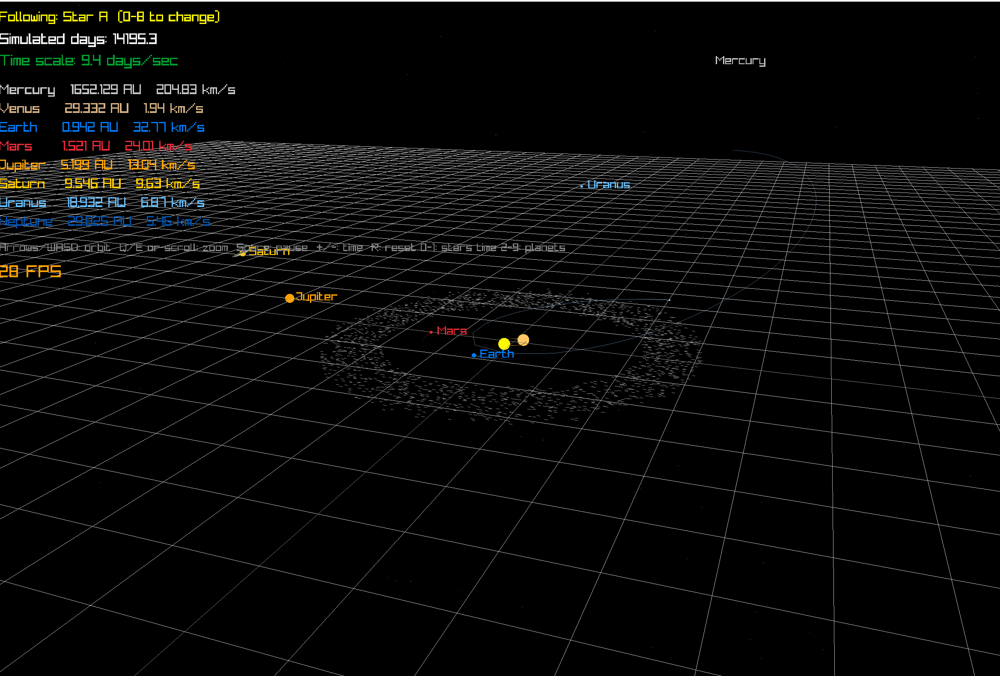

# Gravity Sim

A real-time N-body gravity simulator written in C++ using raylib. Simulates a binary star system with all 8 planets, an asteroid belt, Saturn's rings, and a Halley-style comet — all governed by Newton's law of gravitation.



---

## What it simulates

- **Binary star system** — two stars orbiting their common center of mass. Inner planets (Mercury, Venus) get ejected over time due to chaotic gravitational dynamics. Outer planets find stable circumbinary orbits.
- **8 planets** — Mercury through Neptune, with real masses, orbital radii, and velocities from NASA data.
- **2000-body asteroid belt** — randomly distributed between Mars (1.52 AU) and Jupiter (5.20 AU). Jupiter actively deflects asteroids every frame. Asteroid-asteroid gravity is skipped for performance (physically justified — they're too light to matter).
- **Saturn's rings** — 6 concentric bands of 800 points each, tilted 26.7° to match Saturn's real axial tilt.
- **Halley-style comet** — highly elliptical retrograde orbit, tilted 30° out of the orbital plane. Trail is dense near the stars (fast) and sparse far out (slow) — Kepler's second law made visible.
- **2000 background stars** — scattered on a sphere around the scene for spatial reference.

---

## Physics

- **Newton's law of gravitation**: `F = G·m₁·m₂·r̂ / r²` applied to every body pair every frame
- **Semi-implicit Euler integration**: velocity updated first, then position — symplectic property keeps orbits stable over long runs without energy drift
- **Center-of-mass correction**: total system momentum cancelled at startup so the solar system stays centered on screen (equivalent to choosing the COM reference frame)
- **N-body**: every non-asteroid body feels gravity from every other non-asteroid body. Asteroids feel gravity from planets but not from each other.

---

## Things you'll see

**Chaotic ejection**: Mercury is ejected almost immediately — it orbits between the two stars and gets yanked chaotically until flung out. Venus follows after several simulated years. This is deterministic chaos, not randomness.

**Kepler's second law**: the comet trail is dense near the stars (fast) and sparse far out (slow). Equal areas swept in equal times, drawn by the physics itself.

**Jupiter as shield**: Jupiter's gravity actively deflects asteroids every frame. The asteroid belt thins over time as Jupiter clears its neighborhood.

**Binary wobble**: zoom in on the two stars and watch their trails — matching curves orbiting the center of mass, mirror images of each other. Newton's third law made visible.

**Orbital precession at high time speed**: crank the time scale very high and watch inner planets trace spirograph patterns — integration error accumulates as artificial precession, visually identical to real Mercury precession (which is caused by General Relativity).

---

## Build

### Requirements

- macOS (Apple Silicon or Intel)
- Clang with C++17 support (`xcode-select --install`)
- raylib (`brew install raylib`)

### Compile

```bash
make
```

### Run

```bash
./sim
```

### Intel Mac

If you're on an Intel Mac, edit the `Makefile` and change `/opt/homebrew` to `/usr/local` in the `INCLUDES` and `LIBS` lines.

---

## Controls

| Key | Action |
|-----|--------|
| `↑ ↓ ← →` or `WASD` | Orbit camera |
| `Q` / `E` or scroll | Zoom in / out |
| `Space` | Pause / unpause |
| `+` / `-` | Speed up / slow down time |
| `R` | Reset time scale to 1 day/frame |
| `0` | Follow Star A |
| `1` | Follow Star B |
| `2–9` | Follow planets (Mercury–Neptune) |

---

## Project structure

```
gravity-sim/
├── Vec3.h          # 3D vector math (operator overloading, magnitude)
├── Body.h          # Body struct (position, velocity, mass, trail)
├── Physics.h/.cpp  # Force calculation and integration
├── Renderer.h/.cpp # All rendering (scene, overlay, rings, stars)
├── Camera.h/.cpp   # Spherical coordinate camera controller
├── main.cpp        # Setup, main loop
└── Makefile
```

---

## Concepts implemented

- Vector math with operator overloading
- N-body gravitational simulation (O(n²) pairwise forces)
- Semi-implicit (symplectic) Euler integration
- Numerical integration and timestep stability
- Center-of-mass reference frame selection
- Spherical coordinate camera
- 3D-to-2D projection for UI labels
- Fixed timestep physics with variable render rate
- Circular buffer trail system (`std::deque`)
- Orbital mechanics: ellipses, escape velocity, precession, Kepler's laws

---

## Why things happen

**Mercury gets ejected**: the binary separation (0.4 AU) is close to Mercury's orbital radius (0.39 AU). The critical stability radius for a circumbinary orbit is roughly 2–4× the binary separation — Mercury is well inside this zone.

**The comet speeds up near the stars**: conservation of energy. Far out: high potential energy, low kinetic energy (slow). Close in: potential energy converts to kinetic energy (fast). Same reason a roller coaster is fastest at the bottom.

**The system doesn't drift off screen**: at startup we compute the total momentum of all bodies and subtract the center-of-mass velocity from everyone. Total momentum becomes zero, so the COM stays fixed at the origin forever (Newton's first law).

**The spirograph patterns at high time speed**: semi-implicit Euler is first-order accurate. With large timesteps, each orbit has a small error, causing the orbit to not quite close — it rotates slightly each loop. Over many orbits this builds into the rose pattern. This is integration error, not physics. Real Mercury precesses for different reasons (General Relativity adds 43 arcseconds per century).

---

## Built with

- **C++17**
- **raylib** — simple C graphics library
- Real planetary data from NASA

---

## Author

Arpan Chauhan